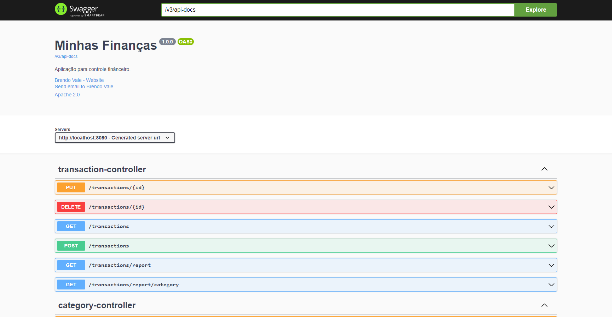

# Minhas Finanças - Java Spring Boot API
Aplicação para controle financeiro de forma simples, respeitando as 
regras da contabilidade. * [Documentação](https://finance-java-spring.herokuapp.com/)

## Tipo de lançamento para transação
| Crédito | Débito  |
|-------|---------|
| Saída | Entrada |
